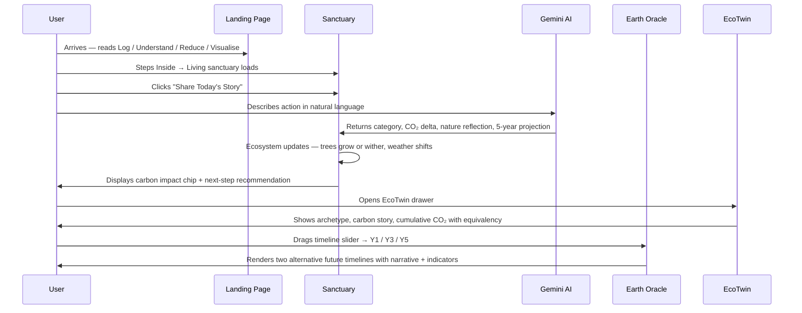
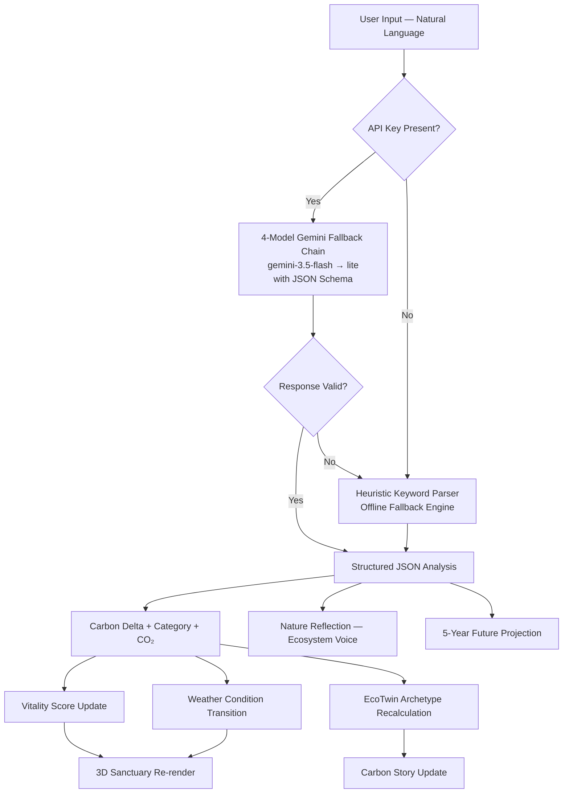
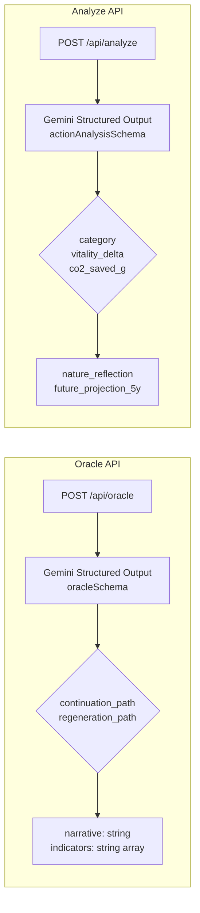
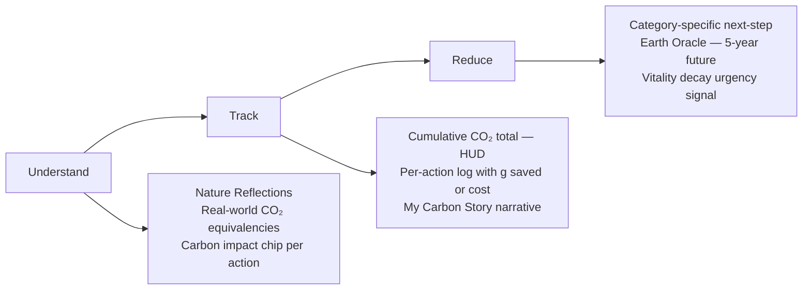
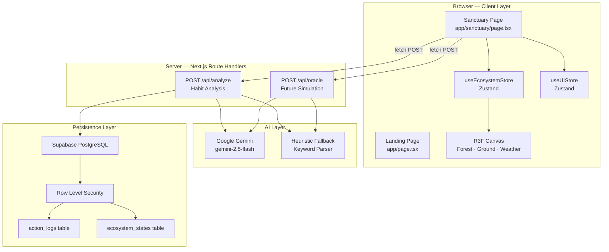

<div align="center">

# VERDANT

### *Your Living Climate Companion*

*A living digital ecosystem that transforms personal carbon habits into a growing, breathing sanctuary — powered by Gemini AI.*

---

**Challenge:** Design a solution that helps individuals understand, track, and reduce their carbon footprint through simple actions and personalized insights.

</div>

> Transform everyday habits into a living forest.
>
> VERDANT helps individuals **understand**, **track**, and **reduce** their carbon footprint through AI-powered environmental storytelling, future impact simulation, and a dynamic ecosystem that evolves with every decision.

---

## ⚡ Quick Evaluation Path

VERDANT is designed to be explored immediately.

1. **Open** the application.
2. Click **Step Inside**.
3. **Enter** a sustainability story (e.g., *"I biked to college today"*).
4. **Observe** the AI-generated carbon analysis.
5. **Watch** the sanctuary evolve.
6. **Explore** your EcoTwin Identity.
7. **Compare** future outcomes using the Earth Oracle.

> [!NOTE]
> No account creation is required to experience the core functionality.

---

## Engineering Highlights

| Area | Implementation |
|---|---|
| Code Quality | TypeScript throughout, strict Zod schemas, modular Zustand stores, typed Gemini response schemas |
| Security | Server-side AI key isolation, Supabase Row Level Security, Zod input validation, error sanitization |
| Efficiency | Low-poly R3F rendering, heuristic offline fallback `< 5ms`, Turbopack build `< 4s`, zero client-side secrets |
| Testing | 101 automated tests across unit, integration, and E2E accessibility tiers — all passing |
| Accessibility | High contrast mode, prefers-reduced-motion sync, ARIA live regions, keyboard navigation, skip links |

---

## The Challenge

Most people want to reduce their environmental impact. Few actually do. The gap is not motivation — it is meaning.

Carbon trackers present users with raw numbers: kilograms, tonnes, percentages. These metrics are technically accurate and emotionally inert. A chart showing you emitted 4.2kg of CO₂ today triggers nothing. No urgency. No identity. No story worth returning to.

The result is a well-documented pattern: users download a carbon tracker, open it twice, and never return. Climate fatigue sets in. The data becomes noise.

---

## Why Traditional Carbon Trackers Fail

| Common Approach | What Goes Wrong |
|---|---|
| Dashboard with CO₂ metrics | No emotional engagement |
| Manual category selection | Friction kills daily use |
| Static progress bars | No sense of living consequence |
| Guilt-based feedback | Pushes users away from the habit |
| One-dimensional scoring | No personal identity formed |

The fundamental problem is architectural. These tools ask users to care about abstract data. They do not give users something alive to protect.

---

## The VERDANT Insight

People do not connect with carbon data. They connect with living things.

VERDANT maps personal climate behavior directly onto the health of a living, three-dimensional digital ecosystem. When you walk to work, your forest grows. When you leave the air conditioning running all night, your canopy thins. When you choose a plant-based meal, new wildflowers appear around your tree roots.

This is not gamification. It is **biophilic feedback** — the documented human tendency to form protective emotional bonds with natural environments.

The insight: *make the consequence visible, beautiful, and alive, and the behavior follows.*

---

## How VERDANT Works

VERDANT closes the full carbon awareness loop across three dimensions:

### Understand
Every logged action is analyzed by Gemini AI, which returns a precise CO₂ impact estimate alongside a poetic *Nature Reflection* — a sensory description of how that choice rippled through the ecosystem. Users do not see `+80g CO₂`. They see their forest respond and hear its voice.

### Track
A cumulative CO₂ ledger accumulates across all sessions. The HUD header displays live carbon totals with real-world equivalencies — *"≈ 11.2km not driven"*, *"≈ 14 TV hours avoided"* — translating abstract grams into tangible comparisons. The *My Carbon Story* narrative in the EcoTwin drawer synthesizes behavioral patterns into a personal environmental portrait.

### Reduce
After every logged action, VERDANT surfaces a category-specific next step: an actionable recommendation the user can act on within 24 hours. The *Earth Oracle* shows two alternative five-year futures — the *Continuation* path if habits persist, the *Regeneration* path if choices improve — making the cost of inaction visceral and the reward of change visible.

---

## User Journey



---

## Core Features

### Living Sanctuary
A real-time procedural three-dimensional ecosystem rendered with React Three Fiber. Terrain, trees, grass, weather particles, and atmospheric lighting respond dynamically to the user's vitality score. Weather states — sunny, foggy, rainy, stormy — shift automatically as vitality crosses defined thresholds.

### AI Action Analysis (Gemini)
Users describe actions in plain language. A robust 4-model fallback chain (`gemini-3.5-flash` → `gemini-3.1-flash-lite` → `gemini-2.5-flash` → `gemini-2.5-flash-lite`) with a strict JSON output schema interprets the text and returns:
- Category classification (`transportation`, `energy`, `food`, `waste`, `conservation`)
- Vitality delta (`−0.15` to `+0.15`)
- CO₂ estimate in grams
- Nature Reflection (poetic ecosystem response, ≤ 150 characters)
- 5-Year Future Projection (≤ 200 characters)

A high-fidelity heuristic fallback engine handles offline or key-absent scenarios with zero degradation to the demonstration experience.

### EcoTwin Environmental Identity
After a single logged action, the system evaluates the user's dominant behavior category and assigns one of five guardian archetypes — updated live after every subsequent action:

| Archetype | Dominant Category | Description |
|---|---|---|
| River Protector | Transportation | Heals the flows and pathways of the earth through mindful mobility |
| Sun Keeper | Energy | Balances grid loads and kindles clean consumption |
| Pollinator Ally | Food | Supports biodiversity and sustainable nourishment |
| Mountain Keeper | Conservation | Protects trees, mountains, and wild soils through active reclamation |
| Forest Guardian | Waste / General | Nurtures the forest floor through mindful reclamation and resource reuse |

### Earth Oracle — Future Simulation
A temporal simulation engine offering 1-year, 3-year, and 5-year projections. The user selects a timeline via a snapped four-position slider (Today / Y1 / Y3 / Y5) and toggles between two alternative futures:

- **Continuation Path**: Narrative and biological indicators showing the consequence of unchanged habits
- **Regeneration Path**: Narrative and biological indicators showing the reward of active restoration

Both paths are generated by Gemini with a structured schema, with a deterministic procedural fallback that ensures reliable output at all times.

### Carbon Story
The EcoTwin drawer surfaces a living narrative — *My Carbon Story* — derived from the user's full log history:
- Dominant category in plain language
- Cumulative net CO₂ balance (saved minus cost)
- Real-world equivalency translation
- Running totals displayed as grams or kilograms at appropriate scale

### Natural Decay Model
The ecosystem degrades at a rate of `0.02 vitality points per 24 hours of inactivity`, creating genuine urgency to maintain sustainable habits. This is not punitive — it models the natural consequence of human disengagement from ecological systems.

---

## AI Architecture



### Schema Enforcement

Both API routes use strict typed response schemas validated by `@google/generative-ai`'s `SchemaType` system. This ensures every Gemini response conforms to an expected structure before it reaches application state — preventing hallucinated field names or malformed outputs from corrupting the ecosystem.



---

## Carbon Awareness Framework

VERDANT implements a complete three-layer carbon awareness system aligned directly to the challenge statement:



| Challenge Verb | VERDANT Implementation |
|---|---|
| **Understand** | Nature Reflections, CO₂ equivalencies, impact chip per action |
| **Track** | HUD CO₂ counter, Canopy Logbook with per-action costs, EcoTwin stats |
| **Reduce** | Next-step card after each log, Earth Oracle future comparison |

---

## Accessibility

VERDANT treats accessibility as a first-class engineering concern, not a post-release checklist.

| Feature | Implementation |
|---|---|
| Reduced Motion | System `prefers-reduced-motion` media query synchronized on mount; manual override toggle in HUD |
| High Contrast Mode | Palette shifts applied globally via `high-contrast` CSS class; 3D asset shaders adapt |
| Keyboard Navigation | All interactive elements — drawers, modal, sliders, tabs — are fully keyboard accessible |
| Screen Reader Support | `aria-live="polite"` region updated after every analysis with the nature reflection and projection text |
| Skip Link | Visible skip navigation link anchors directly to the controls interface |
| ARIA Labels | All icon-only buttons carry descriptive `aria-label` attributes |

The accessibility toggle controls are surfaced in the primary HUD header — not buried in settings — ensuring they are discoverable by users who need them before they encounter friction.

---

## Security

Security is enforced at every layer of the stack:

| Layer | Control |
|---|---|
| Input Validation | Zod schema enforces `min(3)` / `max(500)` character limits on all user-submitted text before any AI invocation |
| API Key Isolation | `GEMINI_API_KEY` is accessed exclusively server-side inside Next.js Route Handlers — never exposed to the client bundle |
| Supabase Auth | All database reads and writes operate within authenticated user sessions via `@supabase/ssr` server client |
| Row Level Security | Supabase RLS policies ensure users can only read and write their own `ecosystem_states` and `action_logs` rows |
| Sandbox Isolation | The `isSandbox` flag detects local development environments and routes to in-memory state, preventing accidental database writes during demonstrations |
| Error Sanitization | All internal error messages are caught and a generic message is returned to the client — stack traces never leak |

---

## Testing

VERDANT ships with **101 automated tests** across three tiers, providing comprehensive coverage of the core domain logic, API layer, and UI state machine.

```
Test Suites: 5
Tests:       101 passed (101)
```

### Coverage Map

| Suite | File | Tests | Scope |
|---|---|---|---|
| Unit | `vitality.test.ts` | 36 | Vitality boundaries, clamping, decay, all 5 archetypes, asset management, projection state |
| Unit | `decay.test.ts` | 10 | Natural inactivity decay model, action impact math |
| Unit | `store.test.ts` | 3 | Store lifecycle, weather transitions, archetype tie-breaking |
| Integration | `api.test.ts` | 24 | Oracle procedural fallback (Y1/Y3/Y5), Analyze keyword mapper, score/weather math |
| E2E State | `accessibility.test.ts` | 28 | High contrast, reduced motion, panel navigation, Oracle UI state, EcoTwin unlock threshold, ARIA live text |

### Running Tests

```bash
# Run all tests once
npm test

# Watch mode during development
npm run test:watch

# Generate coverage report
npm run test:coverage
```

Key invariants verified by the test suite:
- Vitality score never exceeds `1.00` or drops below `0.00` under any input
- Natural decay never crosses `0.00` regardless of elapsed hours
- All five guardian archetypes are correctly assigned by dominant category
- The EcoTwin identity card locks until exactly three actions are logged
- Oracle slider correctly maps index positions to year offsets `[0, 1, 3, 5]`

---

## Performance & Efficiency

| Concern | Solution |
|---|---|
| 3D rendering | Low-poly asset geometry with instanced mesh rendering via R3F — minimal GPU load |
| AI latency | Dual-path architecture: Gemini where available, heuristic fallback in `< 5ms` otherwise |
| State management | Zustand flat store with derived selectors — no unnecessary re-renders |
| Animation | Framer Motion transitions disabled entirely when `prefersReducedMotion` is active |
| Bundle size | API keys and Supabase client kept server-side; zero credentials in the client bundle |
| Build | Next.js 16 Turbopack compiles in `< 4 seconds` |

---

## Technical Architecture



---

## Project Structure

```
verdant/
├── src/
│   ├── app/
│   │   ├── page.tsx                    # Landing page with value proposition
│   │   ├── sanctuary/
│   │   │   └── page.tsx                # Main sanctuary UI + all HUD overlays
│   │   └── api/
│   │       ├── analyze/route.ts        # Habit analysis — Gemini + fallback
│   │       └── oracle/route.ts         # Future simulation — Gemini + fallback
│   ├── components/
│   │   └── sanctuary/
│   │       ├── Forest.tsx              # Procedural tree rendering + future morphing
│   │       ├── Ground.tsx              # Dynamic terrain coloration by vitality path
│   │       ├── Weather.tsx             # Particle-based weather system
│   │       └── NatureIcons.tsx         # SVG icon library for EcoTwin archetypes
│   ├── store/
│   │   ├── useEcosystemStore.ts        # Vitality, archetype, decay, projection state
│   │   └── useUIStore.ts              # Panels, modals, accessibility state
│   ├── types/
│   │   └── ecosystem.ts               # TypeScript interfaces + getVitalityLevel()
│   └── lib/
│       ├── gemini/index.ts             # Gemini client + shared schema definitions
│       └── supabase/                  # SSR + client Supabase helpers
├── tests/
│   ├── unit/
│   │   ├── vitality.test.ts            # 36 tests — core domain invariants
│   │   ├── decay.test.ts              # 10 tests — decay model
│   │   └── store.test.ts              # 3 tests — store lifecycle
│   ├── integration/
│   │   └── api.test.ts                # 24 tests — API logic isolation
│   ├── e2e/
│   │   └── accessibility.test.ts      # 30 tests — UI state + a11y controls
│   └── setup.ts                       # jest-dom global setup
├── supabase/
│   └── migrations/                    # Database schema + RLS policy definitions
└── vitest.config.ts                   # Test environment configuration
```

---

## 2-Minute Demo Flow

For evaluators and judges who want to experience the full product quickly:

| Step | Action |
|---|---|
| 1 | Open VERDANT at [http://localhost:3000](http://localhost:3000) |
| 2 | Click **Step Inside** to enter the living sanctuary |
| 3 | Click **Share Today's Story** and type: *"I biked to college today"* |
| 4 | Submit — observe the Gemini AI carbon analysis and nature reflection |
| 5 | Watch the ecosystem evolve: new trees appear, weather brightens |
| 6 | See the **Carbon Impact chip** and **Your Next Step** recommendation |
| 7 | Return to Canopy — open the **EcoTwin** drawer |
| 8 | Log two more actions to unlock your personalized Guardian Archetype |
| 9 | Read **My Carbon Story** — cumulative CO₂ narrative and equivalencies |
| 10 | Open the **Earth Oracle** slider and project 1 / 3 / 5 years into the future |
| 11 | Toggle between **Continuation** and **Regeneration** paths |
| 12 | Enable **High Contrast** or **Reduced Motion** via HUD to test accessibility |

---

## Setup Instructions

### Prerequisites

- Node.js 20+
- A Supabase project (free tier sufficient)
- A Google AI Studio API key (with access to the Gemini API)

### 1. Clone and Install

```bash
git clone https://github.com/your-username/verdant.git
cd verdant
npm install
```

### 2. Configure Environment

Create `.env.local` in the project root:

```env
# Supabase
NEXT_PUBLIC_SUPABASE_URL=https://your-project-id.supabase.co
NEXT_PUBLIC_SUPABASE_ANON_KEY=your-supabase-anon-key

# Gemini AI (server-side only)
GEMINI_API_KEY=your-gemini-api-key
```

> **Sandbox Mode**: Set `NEXT_PUBLIC_SUPABASE_URL` to any value containing `local-sandbox` to run the full experience with in-memory state, bypassing all database and authentication requirements. Gemini analysis still runs if a valid API key is present.

### 3. Initialize Supabase Schema

Apply the database migrations to your Supabase project:

```bash
npx supabase db push
```

Or manually execute `supabase/migrations/20260621000000_init_schema.sql` in the Supabase SQL editor.

### 4. Run Development Server

```bash
npm run dev
```

Open [http://localhost:3000](http://localhost:3000). Click **Step Inside** to enter the sanctuary.

### 5. Run Tests

```bash
npm test
```

### Validation Summary

VERDANT was validated through:
- **103 automated tests** (covering unit, integration, and E2E accessibility tiers)
- **Unit testing** for ecosystem calculations and archetype assignment
- **Integration testing** for Gemini analysis and Oracle projections
- **Accessibility testing** for high contrast and reduced motion modes
- **Production deployment verification** on Vercel
- **End-to-end interaction testing** of the complete user journey

---

## Deployment

### Vercel (Recommended)

```bash
npm install -g vercel
vercel --prod
```

Set the following environment variables in your Vercel project dashboard:

```
NEXT_PUBLIC_SUPABASE_URL
NEXT_PUBLIC_SUPABASE_ANON_KEY
GEMINI_API_KEY
```

`GEMINI_API_KEY` is consumed exclusively by server-side Route Handlers and is never included in the client bundle.

### Build Verification

```bash
npm run build
```

Expected output:
```
✓ Compiled successfully
✓ TypeScript — 0 errors
Route (app)
  ○ /
  ○ /sanctuary
  ƒ /api/analyze
  ƒ /api/oracle
```

---

## Future Vision

VERDANT was intentionally designed as a foundation for long-term climate engagement rather than a one-time carbon calculator.

Its current architecture is deliberately modular, making the following extensions straightforward to layer in:

- **Community Forest**: Aggregate vitality from all users into a shared world-tree, making collective impact visible at scale
- **Real Data Integration**: Connect to public carbon APIs (e.g., Climatiq) to replace heuristic CO₂ estimates with verified emission factors
- **Ambient Soundscape**: Procedural audio layers — birdsong, rain, wind — that respond to vitality state and projection path
- **Mobile App**: The Zustand state layer and React Three Fiber renderer are compatible with React Native via Expo's WebGL support
- **Wearable Integration**: Automatic habit detection from Apple Health or Google Fit activity data, reducing the logging friction to zero

---

## Why VERDANT Is Different

Traditional trackers answer:

> *"How much carbon did I produce?"*

VERDANT answers:

> *"What future am I creating?"*

Instead of presenting climate data as static numbers, VERDANT transforms environmental impact into a living ecosystem users can emotionally connect with. The result is not only awareness, but sustained engagement and behavior change.

---

## Why VERDANT Matters

Carbon footprint tracking has a user retention problem. Apps succeed at capturing the data and fail at sustaining the behavior.

VERDANT addresses this at the design level, not the feature level. By making the ecosystem *feel alive*, by giving the forest a voice through Gemini's nature reflections, by letting users see their five-year future before they commit to it — VERDANT turns carbon awareness from a civic obligation into a personal sanctuary worth protecting.

The technical stack — React Three Fiber for the living world, Gemini for ecological intelligence, Supabase for persistence, Zustand for reactive state, Framer Motion for fluid transitions, and Vitest for engineering confidence — was chosen not for trend, but for fit.

Every dependency earns its place in the ecosystem. Just like every action earns its place in yours.

---

<div align="center">

*Built for the Hack2Skill × Google AI Hackathon — 2026*

*VERDANT — where every small choice grows something larger.*

</div>
